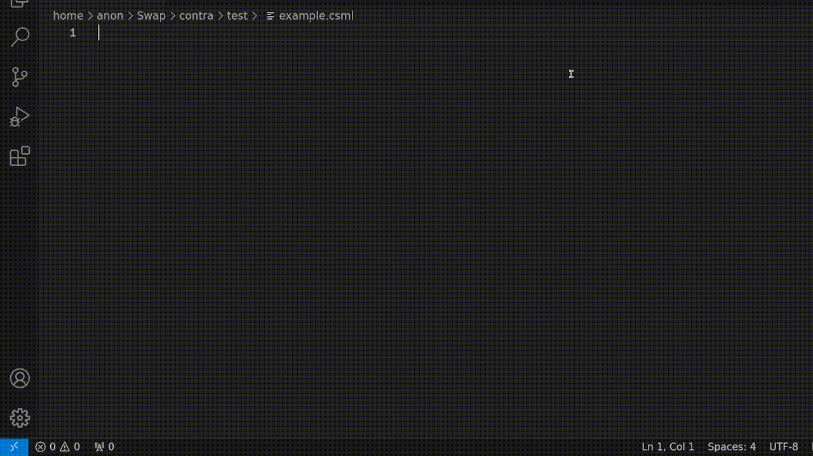

# Contra
> The Contra utility converts [C Style Markup Language](definition of C style markup) to HTML/XML and back.
> The primary aim is to maximize both editability and readability by dynamizing the markup representation.

## Who is it for
Contra is meant for toolmakers who are building text editors and IDEs

## Example

I would show a side by side picture here.  I don't know how to do that with markup.


See `documentation/*` for the exact details or follow this README for a quick-start.

### Example



If someone is used to writing \*script,
this should be more comfortable to type out:

```C
p {
    foo br;
    bar br;
}
```

And press `Alt + Shift + C` (in VScode),
then to type out this with:

```HTML
<p>
    foo <br/>
    bar <br/>
</p>
```

Yet, the two are equivalent using Contra.

### Using Contra

```sh
contra input.txt > output.txt

```

### Who isn't it for?

What seems like a good usecase for Contra that visotrs ask about, but really doesn't fit with what your trying to accomplish?


### Installation
For any of the below plugins to work,
the Contra executable will have to be installed on your system.

##### Build from source
Contra is written in C++,
it must be compiled.

Make sure you have the following compile time dependencies:
 + a C++ compiler (e.g. g++)
 + Make (e.g. GNU Make)
 + Flex

After navigating to the root directory, run:
```Bash
$ make
```
This will result in a new executable file called `contra`,
place it in your `$PATH`.
The easiest way to do so is by running:
```Bash
$ make install
```

#### Vim
Place the file "plugin/contra.vim" inside "~/.vim/plugin/".
You might have to create the directory yourself.
Or,
assuming your setup actually matches with the above,
you could run:
```Bash
$ make vim_install
```

#### Visual Studio Code
The [VS Code extension](Link) is written in TypeScript,
so it has to be compiled too.
This will require a million node modules.
You are advised to run:
```Bash
$ make code_install
```
